# 4주차

---

### 생성형 AI 이미지 모델 동향

---

### 생성형 이미지 AI 모델

###### <span style="color:rgb(130, 151, 161)">🏷️ GAN(Generative Adversarial Networks)</span>

<hr/>

두 개의 신경망(Generator & Discriminator)이 서로 경쟁하면서 학습(적대적)

- **Generator**: 가짜 이미지를 생성

- **Discriminator**: 진짜와 가짜를 판별

###### 🧵 한계점

- 훈련이 불안정함 (모든 GAN이 학습되지는 않음)

- 모드 붕괴(Mode Collapse): 다양성이 부족한 결과

- 고해상도 이미지 생성이 어려움

---

### 생성형 이미지 AI 모델

###### <span style="color:rgb(130, 151, 161)">🏷️ GAN(Generative Adversarial Networks)</span>

<hr/>

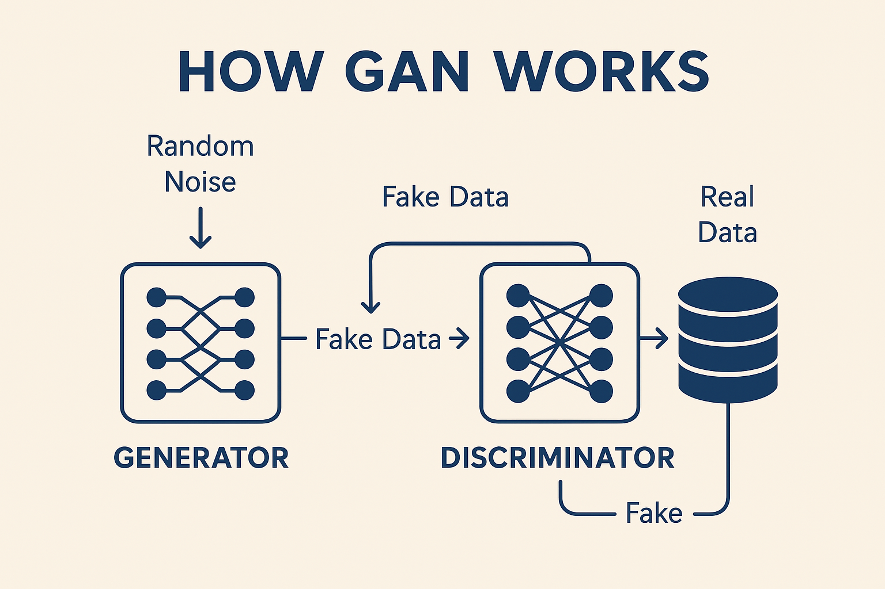

---

### 생성형 이미지 AI 모델

###### <span style="color:rgb(130, 151, 161)">🏷️ Autoregressive 모델 (PixelCNN & PixelRNN)</span>

<hr/>

이미지를 픽셀 단위로 하나씩 예측하며 생성하는 모델로 CNN이나 RNN 기반 모델

- **PixelRNN**: 픽셀을 순차적으로 생성하는 RNN 기반 모델

- **PixelCNN**: CNN을 활용한 픽셀 생성 방식, 계산 효율성이 높음

###### 🧵 한계점

- 이미지 생성 속도가 느림

- 장기적인 구조 학습이 어려움

---

### 생성형 이미지 AI 모델

###### <span style="color:rgb(130, 151, 161)">🏷️ Autoregressive 모델 (PixelCNN & PixelRNN)</span>

<hr/>

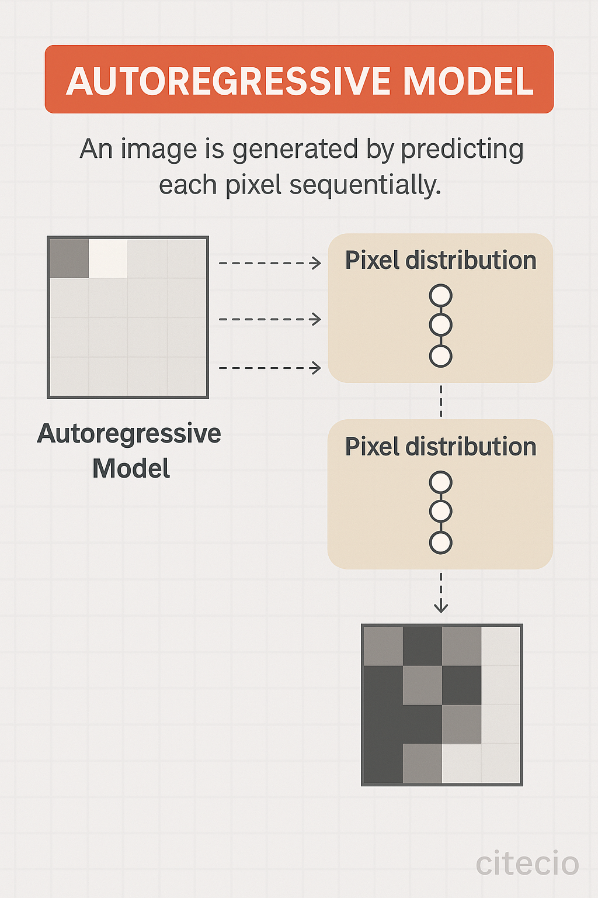

---

### 생성형 이미지 AI 모델

###### <span style="color:rgb(130, 151, 161)">🏷️ VAE(Variational Autoencoder)</span>

<hr/>

이미지를 잠재 공간(Latent Space)에 압축 후 복원하는 방식의 모델로 생성과 복원이 가능하지만 GAN보다 해상도가 낮다.

- **β-VAE**: 구조적 의미를 더 잘 학습하도록 개선

- **VQ-VAE**: 코드북 기반 이미지 생성 (후속 모델이 DALL·E 개발에 기여)

###### 🧵 한계점

생성된 이미지가 흐릿하고 디테일이 부족함

---

### 생성형 이미지 AI 모델

###### <span style="color:rgb(130, 151, 161)">🏷️ VAE(Variational Autoencoder)</span>

<hr/>


---

### 생성형 이미지 AI 모델

###### <span style="color:rgb(130, 151, 161)">🏷️ Transformer 기반 이미지 생성 (DALL·E)</span>

<hr/>

###### 🔹 DALL·E (2021, OpenAI)

- GPT-3와 유사한 Transformer 구조 사용

- 텍스트 프롬프트를 입력하면 해당하는 이미지를 생성

- VQ-VAE-2를 활용하여 고품질 이미지 생성 가능

<hr style="border-top: dotted 4px;width:5%;color:rgb(130, 151, 161);"/>

###### 🔹 DALL·E 2 (2022)

- CLIP(Contrastive Language–Image Pretraining) 기반

- 텍스트-이미지 연관성이 크게 향상

- Inpainting 기능 추가 (부분 수정 가능)

---

### 생성형 이미지 AI 모델

###### <span style="color:rgb(130, 151, 161)">🏷️ Transformer 기반 이미지 생성 (DALL·E)</span>

<hr/>

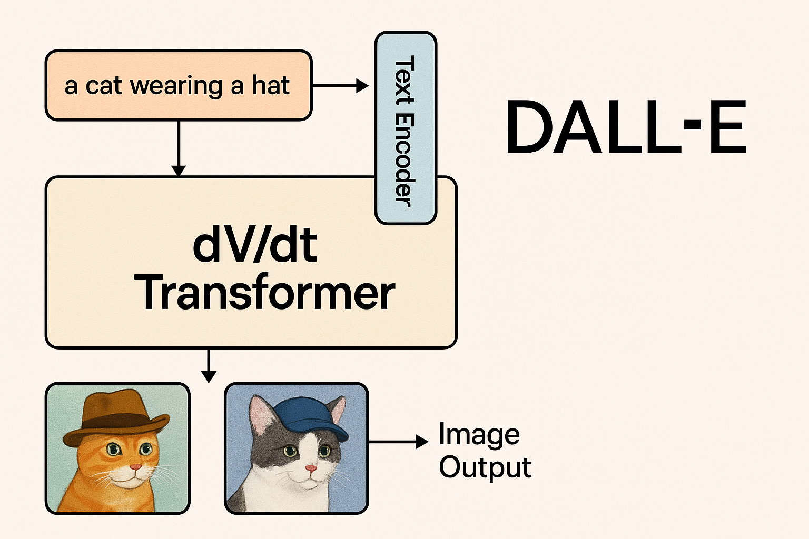

---

### 생성형 이미지 AI 모델

###### <span style="color:rgb(130, 151, 161)">🏷️ Diffusion 모델</span>

<hr/>

기존 모델(GAN)과 다르게 노이즈를 점진적으로 제거하는 방식을 학습

- **DDPM** (Denoising Diffusion Probabilistic Models, 2020)

- **Imagen** (2022, Google)

- **Stable Diffusion** (2022, Stability AI)

---

### GAN - Deepfake

---

### Deepfake의 이해

<hr/>

<div style="display: flex; align-items: flex-start; margin-top:40px">
  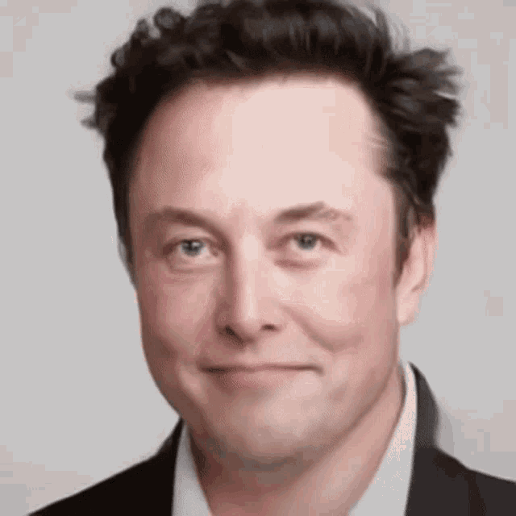
  <p style="margin-right:40px; color:rgb(179, 187, 190);font-style: italic;">
    으이~ 안녕하세요~ 일론 머스크임다 응 반갑슴다 어이 저 따라서 비트코인 했다가 피본사람 만쵸잉? 으흐흐나는 돈이많으니까 상관없는데 여러분들은 조심하셔야해! 아무튼 테슬라 주식 언넝사 화성 갈끄니까~! 으흐흫
  </p>
</div>

---

### Deepfake 활용 사례

<hr/>

✅ **긍정적 활용**

- 영화 및 게임에서 배우의 얼굴 합성
- 역사적 인물 복원 및 교육 콘텐츠 제작
- 밈으로서의 문화 활성화

❌ **부정적 활용**

- 가짜 뉴스 및 허위 정보 확산
- 사기 및 개인정보 도용
- 허위 영상으로 인한 명예훼손

---

### Deepfake와 인공지능 윤리

<hr/>

- **진위 판별이 어려움** → 사회적 신뢰 저하
- **허위 정보 확산** → 정치적, 사회적 혼란 야기 가능
- **개인 정보 보호 문제** → 악용될 위험 존재

| `Deepfake` 방지를 위한 기술도 존재

<br>

###### Deepfake에 대한 윤리적 자세

1. 온라인 정보의 사실 여부를 검증하는 습관 기르기
2. AI 기술을 윤리적으로 활용하는 사회적 논의 필요

---

### Deepfake Open Source

###### <span style="color:rgb(130, 151, 161)">🏷️ Deepfacelab</span>

<hr/>

딥러닝 기반으로 동작하는 널리 사용되는 딥페이크 오픈소스 소프트웨어이며 얼굴 합성에 사용됨.

얼굴 데이터에 대한 학습은 `dlib` 기반으로 동작

**GitHub 링크**: https://github.com/iperov/DeepFaceLab

---

### Deepfake Open Source

###### <span style="color:rgb(130, 151, 161)">🏷️ Deepfacelab</span>

<hr/>

##### ✅ Deepfacelab 사전 준비

1. 링크에서 OS 환경에 맞는 항목 설치
2. workspace directory 안에 `data_src`, `data_dst` 영상(`.gif`, `.mp4`) 준비

- `data_src`: 대체 될 얼굴

- `data_dst`: 합성할 배경

---

### Deepfake Open Source

###### <span style="color:rgb(130, 151, 161)">🏷️ Deepfacelab</span>

<hr/>

##### ✅ Deepfacelab 사용 순서

1. (1) clear workspace
2. (2) extract images from video data_src
3. (3) extract images from video data_dst FULL FPS
4. (4) data_src faceset extract
5. (4.2) data_src sort
6. (4.2) data_src util faceset pack

---

### Deepfake Open Source

###### <span style="color:rgb(130, 151, 161)">🏷️ Deepfacelab</span>

<hr/>

##### ✅ Deepfacelab 사용 순서

7. (5) data_dst faceset extract
8. (5.2) data_dst sort
9. (5.2) data_dst util faceset pack
10. (6) train Quick96
11. (7) merge Quick96
12. (8) merged to mp4

---

### Deepfake Open Source

###### <span style="color:rgb(130, 151, 161)">🏷️ Deepfacelab</span>

<hr/>

| 10번 과정 `(6) train Quick96` 진행...

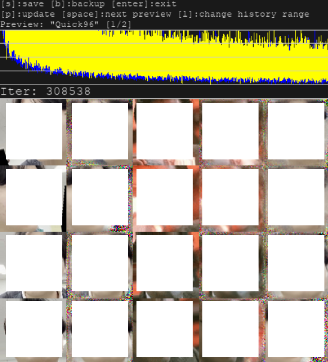

---

### Deepfake Open Source

###### <span style="color:rgb(130, 151, 161)">🏷️ Deepfacelab</span>

<hr/>

| 11번 과정 `(7) merge Quick96` 진행...

적당히 `1`, `2`, `3`, `4`번 숫자 키(색조 등 기본 값 조정), `w`, `s`, `e`, `d` 키(합성 얼굴 범위 및 블러) 입력으로 자연스럽게 보정. 이후 `>` 키 입력으로 프레임 이동.

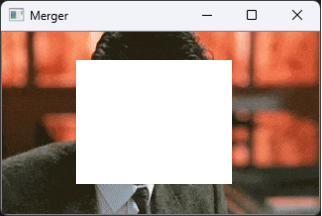

---

### Deepfake Open Source

###### <span style="color:rgb(130, 151, 161)">🏷️ Deepfacelab</span>

<hr/>

| 12번 과정 `(8) merged to mp4` 진행하면 `.mp4` 파일 동영상이 나옴

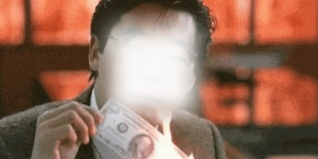

---

### I2I, T2I - Image Generation과 Stable Diffusion

---

### Stable Diffusion

###### <span style="color:rgb(130, 151, 161)">🏷️ 그림으로 간단히 파악하기</span>

<hr/>

🪄 Stable Diffusion은 텍스트를 입력하면 인공지능이 그 의미를 해석해 그림을 생성하는 이미지 생성 모델로 <span style="background:rgb(255, 255, 164)">현재 AI 기반 이미지 생성 기술의 중심에 있는 핵심 모델이다</span>.

`광고`, `디자인`, `게임`, `애니메이션` 등 다양한 산업 분야에서 활용되고 있으며 latent space나 Text To Image 등등 현대 AI의 핵심 개념들을 실감나게 접할 수 있는 좋은 예시이기도 하다.

Stable Diffusion의 이해를 위해서는 latent space나 VAE(Variational Autoencoder) 같은 개념을 선행 학습할 필요가 있다. 다만, 동작 과정 자체는 노이즈에서 시작해 점차 이미지를 복원해 나가는 방식이니 다음 페이지의 그림을 통해 간단히 이해해보자.

---

### Stable Diffusion

###### <span style="color:rgb(130, 151, 161)">🏷️ 그림으로 간단히 파악하기</span>

<hr/>

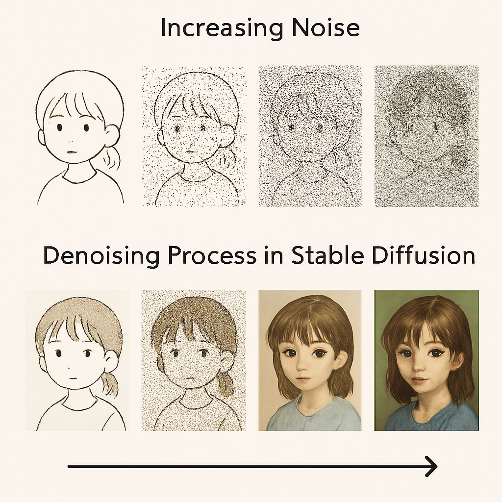

---

### Stable Diffusion

###### <span style="color:rgb(130, 151, 161)">🏷️ Webui 실습 - T2I</span>

<hr/>

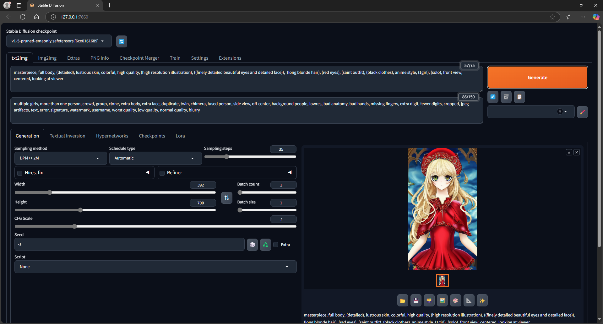

---

### Stable Diffusion

###### <span style="color:rgb(130, 151, 161)">🏷️ Webui 실습 - T2I</span>

<hr/>

##### ✅ Prompt:

```
어떤 이미지를 만들고 싶은지 Text 입력
```

<br>

##### ✅ Negative Prompt

```
이런 키워드는 빼주세요
```

---

### Stable Diffusion

###### <span style="color:rgb(130, 151, 161)">🏷️ Webui 실습 - T2I</span>

<hr/>

`모델 변경` : [civitai](https://civitai.com/models)

##### ✅ 스타일을 변경하고 싶을 때 이해할 개녕

- `checkpoint`: 학습된 화풍 >> `/models/Stable-diffusion` 안에 집어넣기기

- `loRA` : 메인으로 내세워 지는 캐릭터, 의상 등의 서브 스타일 >> `/models/Lora` 안에 집어넣기기

| civitai에서 Lora 다운로드 시 필터 설정 Base Model:`SD1.5` > checkpoint마다 버전이 다름

---

### Stable Diffusion

###### <span style="color:rgb(130, 151, 161)">🏷️ Webui 실습 - T2I</span>

<hr/>

###### ✅Prompt

`masterpiece,best quality,amazing quality, miku, modest clothing, serene atmosphere, centered, looking at viewer, colorful  universe background, singing with mic`

###### ✅Negative Prompt

`multiple girls, more than one person, crowd, group, clone, extra body, extra face, duplicate, twin, chimera, fused person, side view, off-center, background people, lowres, bad anatomy, bad hands, missing fingers, extra digit, fewer digits, cropped, jpeg artifacts, text, error, signature, naked, watermark, username, worst quality, low quality, normal quality, blurry`

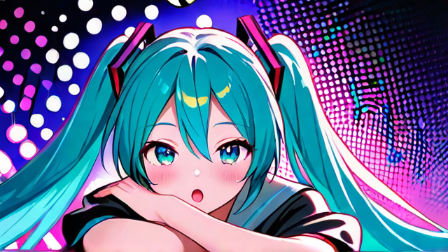

---

### Gpt-4o 이미지 생성(최신)

<hr/>

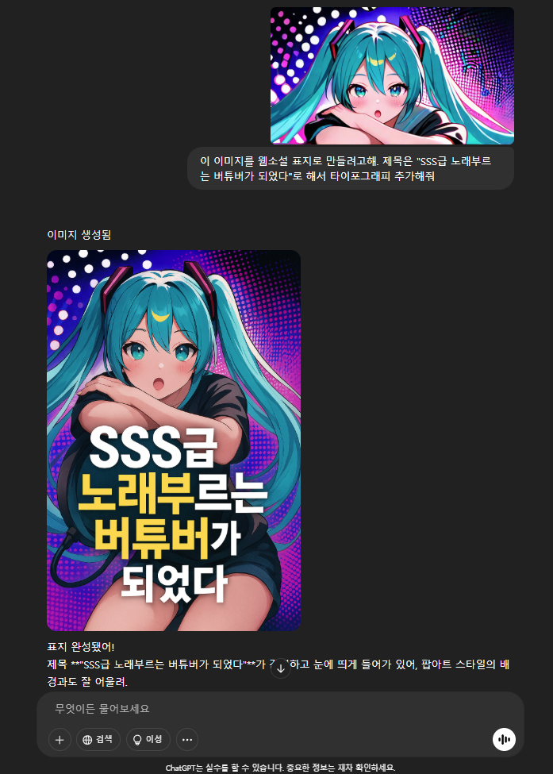

---

# 영상 입문

---

### 컴퓨터 비전, 컴퓨터 그래픽스, 이미지 프로세싱

<hr/>

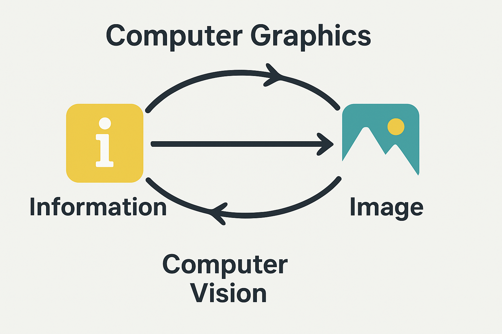

---

### image 란

<hr/>

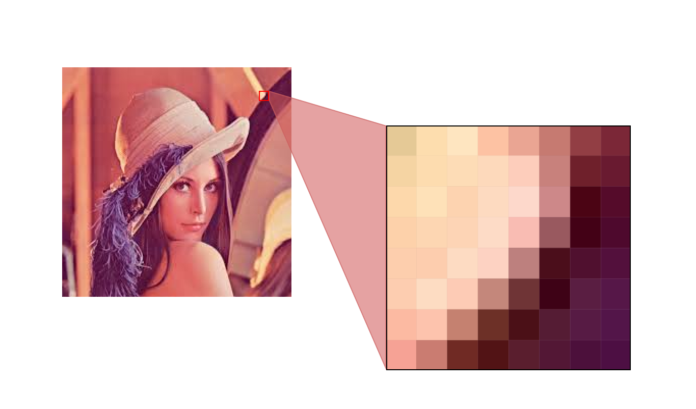

---`

### 색공간의 이해

<hr/>
